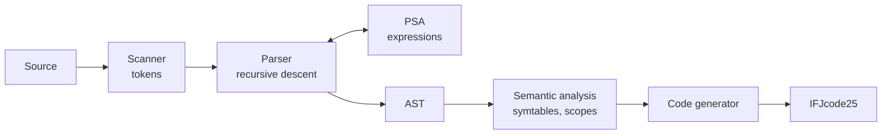

# IFJ25 compiler

A compiler for a **Wren-like** programming language, written in C. It reads a source program from
standard input and emits **IFJcode25** (the course's three-address target code) on standard
output. Built as a four-person team project for the IFJ course (Formal Languages and Compilers)
at BUT FIT.

> Forked from the team repository [MartinMezei/IFJ-projekt](https://github.com/MartinMezei/IFJ-projekt).
> ~10,500 lines of C11.

## Pipeline



1. **Scanner** – turns the input into tokens.
2. **Parser** – recursive-descent syntax analysis of statements and declarations; expressions are
   handed off to a **precedence syntax analyzer (PSA)**. Both build an **abstract syntax tree**.
3. **Semantic analysis** – walks the AST using symbol tables (AVL trees) and a scope stack:
   declarations, types, function arity, redefinitions.
4. **Code generator** – traverses the AST and emits IFJcode25, including the built-in functions.

Implemented assignment extensions: **FUNEXP** and **CYCLES** (described in `dokumentace.pdf`).

## Build & run

```bash
make # builds ./compiler (gcc, C11, AddressSanitizer)
./compiler < program.wren > program.ifjcode
```

The exit code reports the result (0 = success, otherwise the lexical/syntax/semantic/internal
error code defined by the assignment).

## Team

| Member | Main parts |
|--------|------------|
| **Samuel Fačka** ([@faco1228](https://github.com/faco1228)) (xfackas00) | Recursive-descent parser, precedence syntax analyzer (PSA) for expressions, AST builder |
| Martin Mezei ([@MartinMezei](https://github.com/MartinMezei)) (xmezeim00) | Semantic analysis, symbol table (AVL tree), scope stack, compiler driver |
| Martin Racek ([@RacekMartin](https://github.com/RacekMartin)) (xracekm00) | Scanner and lexer, code generation |
| Kristian Cilling ([@Apolinoo](https://github.com/Apolinoo)) (xcillik00) | Built-in functions, error handling, PSA stack |

## My part

I wrote the syntax-analysis front end:

- **`parser.c`** – the recursive-descent parser for the whole non-expression grammar (program
  structure, function definitions, statements, control flow), building AST nodes as it goes.
- **`parser_expression.c`** – the precedence syntax analyzer: operator precedence and
  associativity handled with a precedence table and a stack, reducing expressions into AST
  subtrees and cooperating with the recursive-descent parser.
- **`ast.c`** – the AST node builders and helpers shared by the parser and the later phases.

Full project documentation (in Czech/Slovak) is in `dokumentace.pdf`.
